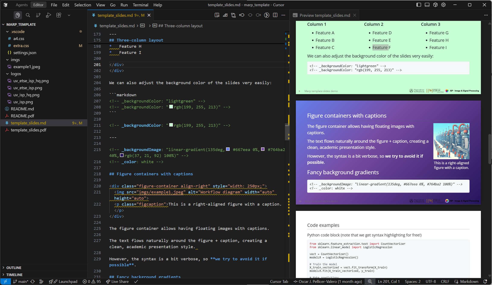
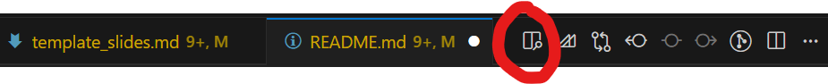

# A Marp template for academic courses

This repostory contains a template for creating academic presentations using **Marp** (Markdown Presentation Ecosystem) with **VS Code**, two custom themes (`extra.css` and `a4.css`), and a guide for setting up VS Code for Marp and start using these themes. 


> How your VS Code should look like when using Marp with this template

The template includes:

- **Two custom themes**:
  - `extra.css`: for presentations, see [`template_slides.md`](template_slides.md) ([raw](https://raw.githubusercontent.com/OscarPellicer/marp_template/main/template_slides.md)) for an example, and [`template_slides.pdf`](https://raw.githubusercontent.com/OscarPellicer/marp_template/main/template_slides.pdf) for a preview.
  - `a4.css`: for documents, see [`README.md`](README.md) ([raw](https://raw.githubusercontent.com/OscarPellicer/marp_template/main/README.md)) (this file) for an example, and [`README.pdf`](https://raw.githubusercontent.com/OscarPellicer/marp_template/main/README.pdf) for a preview.
- **Pre-configured settings** for optimal development experience (improved functionality, pasting images from the clipboard, etc.)
- **Example slides** demonstrating all available features

Why Marp?

- **Markdown-based**: Write presentations in familiar Markdown syntax (including $\LaTeX$ for mathematical expressions, highlighting for code blocks, tables, etc.)
- **Version control friendly**: Easy to track changes with Git
- **Consistent styling**: Professional appearance across all slides
- **Zero compilation time**: The preview updates instantly, unlike other tools like $\LaTeX$
- **Extensible**: Easily add your own themes and features using HTML and CSS
- **AI-friendly**: Easy to integrate with AI tools since it is a Markdown file; also, you don't have to marry a specific model provider (e.g. Copilot for MS Powerpoint)

---

## Prerequisites

Before setting up this template, ensure you have installed VS Code with the following extensions:
- **Marp for VS Code** (essential)
- **Markdown All in One** (helpful for editing)
- **markdownlint** (helpful for linting)

## Repository setup

Clone the Repository and open it in VS Code

```bash
git clone https://github.com/OscarPellicer/marp_template.git
cd marp_template
code .
```

## VS Code configuration

By default, the `.vscode/settings.json` file is already configured for you, but in case it is not working or you want to modify it, you can do so by opening the settings file (`Ctrl+Shift+P` $\rightarrow$ `Preferences: Open User Settings (JSON)`).

```json
{
  // Automatically paste images to imgs folder
  "markdown.editor.filePaste.copyIntoWorkspace": "mediaFiles",
  "markdown.editor.drop.copyIntoWorkspace": "mediaFiles",
  "markdown.copyFiles.destination": {
    "**/*": "imgs/"
  },
  "editor.pasteAs.enabled": true,
  "editor.pasteAs.preferences": ["uri.path.relative"],

  // Use all HTML features in MARP
  "markdown.marp.html": "all",
  "markdown.marp.themes": [
      ".vscode/extra.css",
      ".vscode/a4.css"
  ]
}
```

## Side-by-side preview in VS Code

To view the side-by-side preview of the slides, you can click on the following button on the top right corner of the editor, or press `Ctrl+Shift+V` (Windows/Linux) or `Cmd+Shift+V` (Mac) and move the new tab to the right of the editor:



---

## Creating your first slides

### Starting from scratch

Create a new markdown file (e.g. `slides.md`) in your repository, add the frontmatter and start writing your slides:

```markdown
---
marp: true
theme: extra
paginate: true
html: true
footer: Your Course Name
---

# Your Slide Title

- Bullet point 1
- Bullet point 2
- Bullet point 3

---

## Second Slide


Your content here...
```

### Starting from a PowerPoint presentation

Alternatively, you can use my other repository https://github.com/OscarPellicer/pptx2marp to convert PowerPoint (`.pptx`) presentations to Marp slides, and start from there:

```bash
# Optional: create a new environment
conda create -n md python=3.10
conda activate md

# Install the libraries
pip install -e git+https://github.com/OscarPellicer/pptx2marp.git
pip install -e git+https://github.com/OscarPellicer/python-pptx.git

# Convert the presentation
pptx2md presentation.pptx -o outputs_path/ --marp --disable-color --min-block-size 5 --keep-similar-titles
```

### Starting from a $\LaTeX$ presentation

To convert from $\LaTeX$ to Markdown, I've been using just plain prompting to AI models (Gemini 2.5 Pro in my case). The prompt goes something like this:

> I want you to help me translate some latex slides into marp. I have created a custom theme. Here are some example marp slides showcasing all the features of the theme for your reference:
> 
> {include `template_slides.md`}
>
> I will also be attaching some of the images to the input. You must try to convert them to markdown if possible (e.g. if they are tables, or code, or something simple). Do not go out of your way if the conversion is not straightforward, and just leave them as is, inserted in the markdown. Note that they will all be available with their original filenames under the folder `imgs/`
> 

---

> Also, always replace the name of the teacher by my name and email: {`teacher_name`}, {`teacher_email`}, {`teacher_institution`}
>
> Some extra criteria:
> 1.  **Do not use two-column design:** Avoid `<div class="columns">` entirely.
> 2.  **Use floating images:** Replace column layouts with `![left ...]` or `![right ...]`, placing the image tag **before** the text it surrounds.
> 3.  **Handle large tables:** If a table doesn’t fit in one slide, split it across slides; apply `<!-- _class: smallest -->` to dense tables; tables may coexist with floating images.
> 4.  **Do not use background images:** Avoid `![bg ...]`; instead, use `![center ...]` for main central images.
> 5.  **Scale images:** Use `w:XXXpx` or `h:XXXpx` to fit within slide dimensions (1280×720px).
> 6.  **Convert table images to Markdown:** Any provided image that mainly contains a table must be transcribed into a native Markdown table.
> 7.  **Code structure:** Do not use `<div>` for image positioning; rely on Marp’s native Markdown syntax.
> 8.  **Avoid blockquotes unless semantically valid:** Do not use `>` unless it conveys an actual quotation or semantic block.

Alternatively, if your document is too long, or you don't want to use AI, you can use [pandoc](https://pandoc.org/installing.html) to convert from $\LaTeX$ to Markdown, and then manually adapt the resulting Markdown file to Marp:

```bash
pandoc -s -o output.md input.tex
```

## Available themes

<div class="columns">
<div>

<br>

Extra Theme (`extra.css`)
- **Purpose**: Presentation slides
- **Key features**:
  - Image positioning
  - Multi-column layouts
- **Best for**: Course slides, lectures

</div>
<div>
<br>

A4 Theme (`a4.css`)
- **Purpose**: Document-style pages
- **Key features**:
  - A4 page size (210mm × 297mm)
  - Justified text
- **Best for**: Documentation, reports, exercises

</div>
</div>

## Template features

- **Multi-column grids**: 2 and 3 column layouts
- **Absolute positioning**: Precise element placement
- **Floating images**: Left, right, and center alignment
- **Figure containers**: Allows having floating images with captions
- **Custom fonts**: Open Sans (presentation), Libre Baskerville (A4), etc.
- **Slide sizing**: Small, smaller, smallest classes
- **Mathematical expressions**: LaTeX-style math support
- **Code highlighting**: Syntax highlighting for code blocks
- **Reference styling**: Consistent reference styling
- **Print optimization**: A4 theme optimized for printing

---

## Advanced features

### Multi-Column Layouts

```html
<div class="columns">
<div>

  * First column content
  * Can contain lists, paragraphs, etc.

</div>
<div>

  * Second column content
  * Each column is equally sized

</div>
</div>
```

Figure Containers

```html
<div class="figure-container align-right" style="width: 300px;">
  
  <p class="figcaption">Your caption here.</p>
</div>
```

Absolute Positioning

```html
<div class="abs-pos" style="left: 400px; top: 100px; width: 300px; height: 200px; z-index: 1;">
          
</div>
```

## Exporting to PDF

1. Press `Ctrl+Shift+P` (Windows/Linux) or `Cmd+Shift+P` (Mac)
2. Type `Marp: Export Slide Deck`
3. Choose PDF format
4. Select save location

## Compressing the images in the exported PDF

Note that the images will be exported into the PDF as is. If they are huge in size, the size of the final PDF will be unnecessarily large. If you want to compress the quality of images in the exported PDF, you can use websites such as [SmallPDF](https://smallpdf.com/pdf-compressor) or [ILovePDF](https://www.ilovepdf.com/compress_pdf).

Alternatively, you can use command line tools such as [ImageMagick](https://imagemagick.org/index.php) to compress all the images in a folder, hence compressing their size before exporting.
